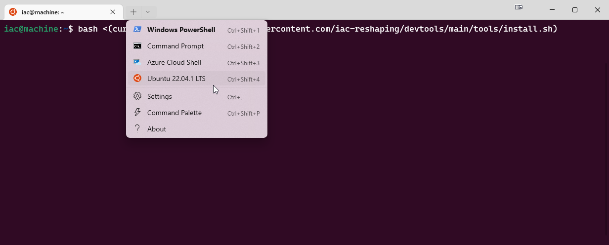

# IAC Development Tools and Dependencies

Welcome to Lab 0 of Autumn Term [Instruction Architectures and Compilers](http://intranet.ee.ic.ac.uk/electricalengineering/eecourses_t4/course_content.asp?c=ELEC50010&s=I2) (IAC).

In this lab, you will install the tools needed for both the labs and coursework.

At the end of the lab you will have installed the following tools:

- [VS Code](https://code.visualstudio.com/Download)
- [Verilator](https://github.com/verilator/verilator) which converts SystemVerilog HDL into a C++ equivalent model
- [riscv-gnu-toolchain](https://github.com/riscv-collab/riscv-gnu-toolchain) which contains RISC-V specific tools such as `riscv64-unknown-elf-gcc`, a cross-compiler for RISC-V programs
- [gtkwave](http://gtkwave.sourceforge.net/) which allows you to view waveforms of your design which were produced by Verilator
- A folder located at [~/Documents/iac](~/Documents/iac) which contains this repository, along with a VS Code workspace used to test that your toolchain has installed correctly

## Installation

### Windows 10 and 11

1) Make sure your version of Windows is up-to-date. You must be running Windows 10 (Build 19041 and higher) or Windows 11.
2) Install [VS Code](https://code.visualstudio.com/Download). Once VS Code is installed, go [here](https://marketplace.visualstudio.com/items?itemName=ms-vscode-remote.vscode-remote-extensionpack) and install the Remote Development extension.
3) Open Command Prompt as *Administrator* and enter `wsl --install` to enable Windows Subsystem for Linux (WSL). You will need to restart your machine after doing this.
4) In Command Prompt, run `wsl --set-default-version 1` to use WSL version 1 instead of version 2. For this coursework, WSL 1 is required as WSL 2 does not support USB device access.
5) Download Ubuntu 22.04 from the [Microsoft Store](https://www.microsoft.com/store/productId/9PN20MSR04DW). If you already have this downloaded, run `wsl --set-version Ubuntu-22.04 1` to make sure this runs under WSL 1.
6) Download [Windows Terminal](https://aka.ms/terminal) for an improved terminal experience
7) Open Windows Terminal and make a new Ubuntu 22.04 terminal
   
8) Inside the Ubuntu terminal, enter

    ```bash
    bash <(curl -fsSL https://raw.githubusercontent.com/EIE2-IAC-Labs/Lab0-devtools/main/tools/install.sh)
    ```

    You may have to enter your password a few times while everything installs.

    Depending on your Internet connection, this may take up to 15 minutes.
9) VS Code should automatically open after the previous step. If not, open the *workspace* at `~/Documents/iac/lab0-devtools/autumn/workspace/iac-autumn.code-workspace`. To do this, open an Ubuntu 22.04 terminal and type `code`; doing this opens a [VS Code instance inside Ubuntu](https://code.visualstudio.com/docs/remote/wsl#_getting-started) rather than Windows. When VS Code opens, select "File->Open Workspace from File...", then navigate to the workspace file. You can also do this by typing the following command in an Ubuntu 22.04 terminal:
   
   ```bash
   code ~/Documents/iac/lab0-devtools/autumn/workspace/iac-autumn.code-workspace
   ```

10) Follow the instructions in the [toolchain project](https://github.com/EIE2-IAC-Labs/Lab0-devtools/blob/main/autumn/workspace/toolchain) to test that your tools are functioning correctly. This folder is already downloaded and can be found in your VS Code workspace you just opened.

### Mac OS Monterey and Ubuntu 22.04

1) Install [VS Code](https://code.visualstudio.com/Download)
2) Open a terminal and enter

    ```bash
    bash <(curl -fsSL https://raw.githubusercontent.com/EIE2-IAC-Labs/Lab0-devtools/main/tools/install.sh)
    ```

    You may have to enter your password a few times while everything installs.

    Depending on your Internet connection, this may take up to 15 minutes.
3) VS Code should automatically open after the previous step. If not, open the *workspace* at `~/Documents/iac/lab0-devtools/autumn/workspace/iac-autumn.code-workspace`; to do this open VS Code, and select "File->Open Workspace from File...", then navigate to the workspace file.
4) Follow the instructions in the [toolchain project](https://github.com/EIE2-IAC-Labs/Lab0-devtools/blob/main/autumn/workspace/toolchain) to test that your tools are functioning correctly. This folder is already downloaded and can be found in your VS Code workspace you just opened.

## Behind the scenes

The `bash <(curl -fsSL https://raw.githubusercontent.com/EIE2-IAC-Labs/Lab0-devtools/main/tools/install.sh)` first runs `curl`, which downloads the [install script](./tools/install.sh) from GitHub. The contents of this file are then redirected to the `bash` shell to be executed.

The `install.sh` script installs a few common dependencies before detecting what Operating System you are running on. It then runs one of the OS specific scripts in the same folder. These  compile Verilator from source, as well as install the riscv-gnu-toolchain from pre-compiled binaries.

## Something didn't work

The most common issue is that the install script may hang while installing extensions on WSL. If this happens and you are on Windows, make sure the [WSL extension](https://marketplace.visualstudio.com/items?itemName=ms-vscode-remote.vscode-remote-extensionpack) installed in VS Code. After you've checked this, skip to the next step and VS Code should automatically ask you to install the recommended extensions when you open the workspace. This is the last step in the installation script, so everything else should work fine after performing this workaround.

The second most common issue for Windows users is that they are not opening the workspace under WSL, rather they are opening it under Windows. First check that you have the [WSL extension](https://marketplace.visualstudio.com/items?itemName=ms-vscode-remote.vscode-remote-extensionpack) installed, then open an Ubuntu 22.04 terminal and run the `code` command to open VS Code under WSL.

If VS Code is running under WSL, you should see `[WSL: Ubuntu-22.04]` in the window title (Apple users can ignore this):


For anything else, check through the closed Github issues or create a new issue in this Github repository.

Make sure to include the full terminal log, along with screenshots and extra
context about which step you were trying to perform.

However, before posting an issue, it is encouraged for you to have a go at
debugging the issue yourself.

Messages starting with `[iac]` are frequently
logged to the terminal, showing you what the script is doing.

By looking at the scripts in the [./tools](tools) directory, you should be able
to find the relevant section based on the last outputted log message.
